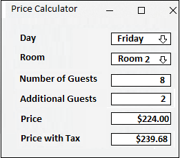
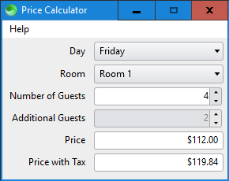

# Price Calculator

A pricing calculator written in HTML, CSS, & TIScript based on the following prototype from [this](https://old.reddit.com/r/programmingrequests/comments/jsgypp/price_calculator/) Reddit thread:

## Preview

## Usage

1. Place the [Sciter](https://sciter.com) executable [scapp.exe](https://github.com/c-smile/sciter-sdk/tree/master/bin.win/x64) inside this folder.

2. Run `scapp.exe`.